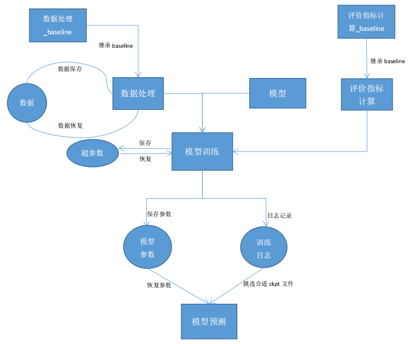

# NLP算法
### 说明
此算法仓库包括文本分类、序列标注、关系抽取、文本匹配、文本相似度匹配这五个主流NLP任务，涉及到22个相关的模型算法。
### 框架结构

### 文件结构
```
all_models
├── Base_line
│   ├── __init__.py
│   ├── base_data_process.py
│   ├── base_evaluation.py
│   ├── single_tokenizer.py
│   └── dict.txt
│
├── Texts_Classification
│   ├── 机器学习_文本分类
│   ├── fasttext_文本分类
│   ├── textcnn_文本分类
│   ├── lstm_文本分类
│   ├── han_文本分类
│   ├── bert_文本分类
│   └── 数据准备
│
├── Sequence_Labeling
│   ├── crf_suite
│   ├── lstm_crf
│   ├── bert_lstm_crf
│   ├── bert_mrc
│   └── 数据准备
│
├── Relation_Extraction
│   ├── CasRel
│   ├── multihead_joint_extraction
│   ├── R-bert_relation_recognition
│   ├── attention_lstm_relation_recognition
│   ├── attention_lstm_relation_recognition_for_single_sentence
│   ├── tagging_scheme_joint_extraction
│   ├── entity_extraction_bert_lstm_crf
│   └── 数据准备
│
├── Text_Matching
│   ├── DSSM
│   ├── ARC-II
│   ├── ESIM
│   ├── bert
│   └── 数据准备
│
├── Text_Similarity_Matching
│   ├── tfidf
│   ├── BM25
│   ├── pysparnn
│   └── commodity_title.txt
│
├── 记录
├── .gitignore
└── README.md
```


