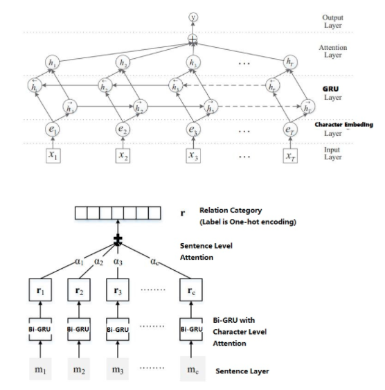

# multihead_joint 关系抽取
## 参数设置
1. DEFAULT
    - uerdict_path 自定义词典的路径
    - stopwords_path 停用词词典的路径
    - tokenizer_name 分词器的名字
2. DATA_PROCESS
    - file_path 文件路径
    - save_path 保存初始化pickle文件路径
    - word2vec_embed_file word2vec的路径
    - fasttext_embed_file fasttext的路径
    - feature_selection_name 选择预训练的模型名称
    - max_seq_length 句子最大长度
3. MODEL
    - max_seq_length 句子最大长度
    - is_training 是否开启训练
    - pos_num 位置标签的长度
    - pos_size 位置标签的embedding维度
    - gru_size GRU的神经元个数
    - update_embedding 是否更新词向量
    - dropout_rate
    - num_layers GRU的层数
    - learning_rate 学习率
    - num_train_epochs 训练轮数
    - batch_size 每批次样本数量
    - shuffle 每次训练是否随机打乱数据
    - display_per_step 每多少步展示一次训练集效果
    - evaluation_per_step 每多少步展示一次验证集效果
    - require_improvement 有多少步没有提升，将停止训练  
    
每次训练必给的参数为:
* uerdict_path 自定义词典的路径（这里需要是空的）
* stopwords_path 停用词词典的路径（这里需要是空的）
* file_path 文件路径
* save_path 保存初始化pickle文件路径
* max_seq_length 句子最大长度
## 模型架构

## 模型说明
此模型为attention+gru的关系分类模型，使用基于词和句的attention，以及gru模块，训练速度较快，效果一般。
## 论文地址
此模型依赖两篇论文，依次是: 
https://www.aclweb.org/anthology/P16-2034.pdf  
https://www.aclweb.org/anthology/P16-1200v2.pdf  