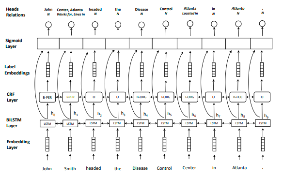

# multihead_joint 关系抽取
## 参数设置
1. DEFAULT
    - uerdict_path 自定义词典的路径
    - stopwords_path 停用词词典的路径
    - tokenizer_name 分词器的名字
2. DATA_PROCESS
    - file_path 文件路径
    - save_path 保存初始化pickle文件路径
    - word2vec_embed_file word2vec的路径
    - fasttext_embed_file fasttext的路径
    - feature_selection_name 选择预训练的模型名称
    - max_seq_length 句子最大长度
3. MODEL
    - max_seq_length 句子最大长度
    - is_training 是否开启训练
    - update_embedding 是否更新词向量
    - embedding_dropout embedding的dropout值
    - num_lstm_layers lstm的层数
    - use_lstm_dropout 是否对lstm层的输出使用dropout
    - lstm_dropout lstm的dropout值
    - hidden_size_lstm lstm的神经元数
    - hidden_size_n1 关系分类的隐层神经元数
    - rel_activation 关系分类的激活函数
    - rel_dropout 关系分类隐藏层输出的dropout值
    - learning_rate 学习率
    - clip 梯度裁剪的范围
    - label_embeddings_size 标签向量化的维度
    - num_train_epochs 训练轮数
    - batch_size 每批次样本数量
    - shuffle 每次训练是否随机打乱数据
    - display_per_step 每多少步展示一次训练集效果
    - evaluation_per_step 每多少步展示一次验证集效果
    - require_improvement 有多少步没有提升，将停止训练  
    
每次训练必给的参数为:
* uerdict_path 自定义词典的路径（这里需要是空的）
* stopwords_path 停用词词典的路径（这里需要是空的）
* file_path 文件路径
* save_path 保存初始化pickle文件路径
* max_seq_length 句子最大长度
## 模型架构

## 模型说明
此模型为多头选择联合抽取模型，以共用多层lstm+crf进行实体识别，共用多层lstm+fc进行关系识别，模型相对速度较快。
## 论文地址
https://arxiv.org/pdf/1804.07847.pdf