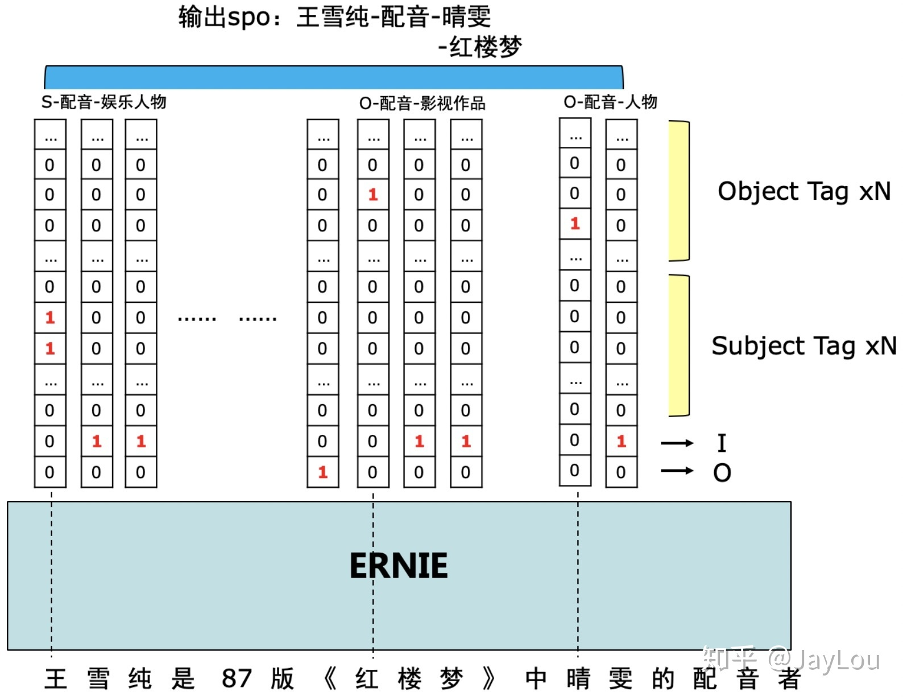

# 基于标签构造的关系抽取
## 参数设置
1. DEFAULT
    - uerdict_path 自定义词典的路径
    - stopwords_path 停用词词典的路径
    - tokenizer_name 分词器的名字
2. DATA_PROCESS
    - file_path 文件路径
    - save_path 保存初始化pickle文件路径
    - vocab_file 词表路径
    - max_seq_length 句子最大长度
3. MODEL
    - max_seq_length 句子最大长度
    - is_training 是否开启训练
    - bert_config_file bert配置文件路径
    - init_checkpoint bert模型参数文件路径
    - use_lstm 是否加入lstm层
    - hidden_size lstm神经元的数量
    - use_lstm_dropout 在lstm层后是否添加dropout
    - cell_nums RNN层数
    - lstm_dropout lstm层的dropout值
    - embedding_dropout embedding层的dropout值
    - warmup_proportion 慢热学习的速率
    - learning_rate 学习率
    - num_train_epochs 训练轮数
    - batch_size 每批次样本数量
    - shuffle 每次训练是否随机打乱数据
    - display_per_step 每多少步展示一次训练集效果
    - evaluation_per_step 每多少步展示一次验证集效果
    - require_improvement 有多少步没有提升，将停止训练  
    
每次训练必给的参数为:
* uerdict_path 自定义词典的路径（这里需要是空的）
* stopwords_path 停用词词典的路径（这里需要是空的）
* file_path 文件路径
* save_path 保存初始化pickle文件路径
* max_seq_length 句子最大长度
## 模型架构

## 模型说明
此模型为修改标签构造的关系抽取模型，将实体及关系全部蕴含在标签中，以bert+lstm+sigmoid这种实体抽取的模型结构完成关系抽取。
## 论文地址
https://arxiv.org/pdf/1706.05075.pdf