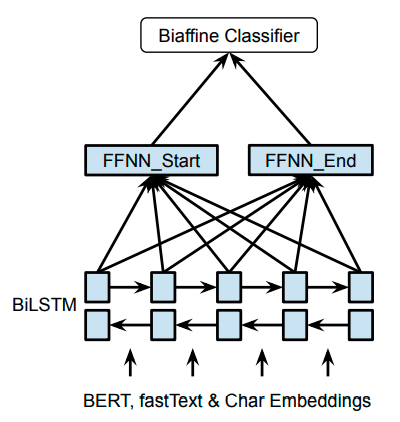

# biaffine+lstm+crf 实体抽取
## 参数设置
1. DEFAULT
    - uerdict_path 自定义词典的路径
    - stopwords_path 停用词词典的路径
    - tokenizer_name 分词器的名字
2. DATA_PROCESS
    - file_path 文件路径
    - save_path 保存初始化pickle文件路径
    - word2vec_embed_file word2vec的路径
    - fasttext_embed_file fasttext的路径
    - feature_selection_name 选择预训练的模型名称
3. MODEL
    - max_seq_length 句子最大长度
    - is_training 是否开启训练
    - update_embedding 是否更新词向量
    - hidden_size 隐含层神经元个数
    - cell_nums lstm的层数
    - use_cnn 是否后接cnn
    - kernel_nums cnn卷积核数量
    - kernel_size cnn卷积核大小
    - clip 梯度裁剪的范围
    - learning_rate 学习率
    - use_decay_learning_rate 是否使用学习率衰减
    - use_l2_regularization 是否使用l2正则
    - num_train_epochs 训练轮数
    - batch_size 每批次样本数量
    - shuffle 每次训练是否随机打乱数据
    - dropout_rate dropout值
    - display_per_step 每多少步展示一次训练集效果
    - evaluation_per_step 每多少步展示一次验证集效果
    - require_improvement 有多少步没有提升，将停止训练  
    
每次训练必给的参数为:
* uerdict_path 自定义词典的路径
* stopwords_path 停用词词典的路径（这里需要是空的）
* file_path 文件路径
* save_path 保存初始化pickle文件路径
* max_seq_length 句子最大长度
## 模型架构

## 模型说明
此模型主体结构为lstm+crf的实体抽取模型，分类部分使用biaffine（双仿射）的机制进行分类，可以解决标签覆盖问题
## 论文地址
https://arxiv.org/pdf/2005.07150.pdf