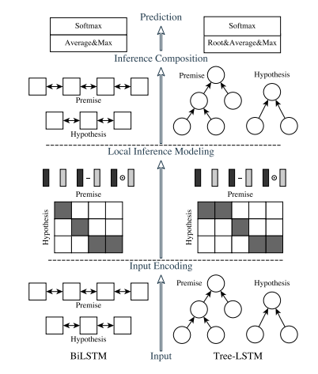

# ESIM 文本匹配
## 参数设置
1. DEFAULT
    - uerdict_path 自定义词典的路径
    - stopwords_path 停用词词典的路径
    - tokenizer_name 分词器的名字
2. DATA_PROCESS
    - file_path 文件路径
    - save_path 保存初始化pickle文件路径
    - feature_selection_name 选择预训练的模型名称
    - embedding_file 词向量的路径
    - vocab_file 词表的路径
    - embed_size 词向量长度
3. MODEL
    - max_seq_length 句子最大长度
    - update_embedding 是否更新词向量
    - is_training 是否开启训练
    - embedding_hidden_size 上层lstm的神经元个数
    - context_hidden_size 下层lstm的神经元个数
    - hidden_units 全连接层的神经元个数
    - dropout_rate dropout的比率
    - learning_rate 学习率
    - num_train_epochs 训练轮数
    - batch_size 每批次样本数量
    - shuffle 每次训练是否随机打乱数据
    - display_per_step 每多少步展示一次训练集效果
    - evaluation_per_step 每多少步展示一次验证集效果
    - require_improvement 有多少步没有提升，将停止训练  
    
每次训练必给的参数为:
* uerdict_path 自定义词典的路径（这里需要是空的）
* stopwords_path 停用词词典的路径（这里需要是空的）
* file_path 文件路径
* save_path 保存初始化pickle文件路径
* max_seq_length 句子最大长度
## 模型架构

## 模型说明
此模型为基于交互的文本匹配模型，底层采用LSTM循环网络，并使用attention机制进行语句交互，模型相对较慢，效果尚可。 
## 论文地址  
https://arxiv.org/pdf/1609.06038.pdf