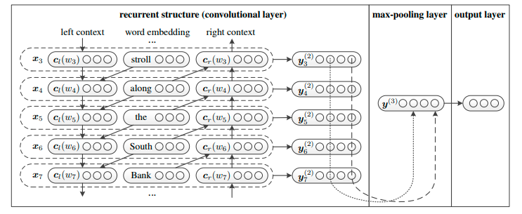

# RCNN文本分类
## 参数设置
1. DEFAULT
    - uerdict_path 自定义词典的路径
    - stopwords_path 停用词词典的路径
    - tokenizer_name 分词器的名字
2. DATA_PROCESS
    - file_path 文件路径
    - save_path 保存初始化pickle文件路径
    - word2vec_embed_file word2vec的路径
    - fasttext_embed_file fasttext的路径
    - feature_selection_name 选择预训练的模型名称
3. MODEL
    - max_seq_length 句子最大长度
    - lstm_hidden_size RNN神经元个数
    - cell_nums RNN层数
    - is_training 是否开启训练
    - update_embedding 是否更新词向量
    - hidden_num 隐含层神经元个数
    - learning_rate 学习率
    - use_l2_regularization 是否使用l2正则
    - use_decay_learning_rate 是否使用学习率衰减
    - num_train_epochs 训练轮数
    - batch_size 每批次样本数量
    - shuffle 每次训练是否随机打乱数据
    - dropout_rate dropout值
    - display_per_step 每多少步展示一次训练集效果
    - evaluation_per_step 每多少步展示一次验证集效果
    - require_improvement 有多少步没有提升，将停止训练  
    
每次训练必给的参数为:
* uerdict_path 自定义词典的路径
* stopwords_path 停用词词典的路径
* file_path 文件路径
* save_path 保存初始化pickle文件路径
* max_seq_length 句子最大长度
## 模型架构

## 模型说明
RCNN提出了一种可以利用单词的上下文信息的双向循环结构进行文本分类，命名为RCNN网络，它可以在时间复杂度为O(n)的前提下，提升文本分类的准确率
## 论文地址
名称: Recurrent Convolutional Neural Networks for Text Classification   
AAAI论文 可自行下载

