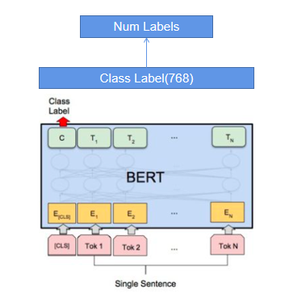

# Bert文本分类
## 参数设置
1. DEFAULT
    - uerdict_path 自定义词典的路径
    - stopwords_path 停用词词典的路径
    - tokenizer_name 分词器的名字
2. DATA_PROCESS
    - file_path 文件路径
    - save_path 保存初始化pickle文件路径
    - do_lower_case 是否将数据都小写
    - vocab_file bert词表的路径
3. MODEL
    - max_seq_length 句子最大长度
    - bert_config_file bert配置文件的路径
    - init_checkpoint bert保存数据文件的路径
    - dropout_rate dropout值
    - learning_rate 学习率
    - is_training 是否开启训练
    - use_l2_regularization 是否使用l2正则
    - use_hidden_layer 是否使用隐含层
    - hidden_num 隐含层神经元个数
    - num_train_epochs 训练轮数
    - batch_size 每批次样本数量
    - warmup_proportion 慢热学习的速率
    - shuffle 每次训练是否随机打乱数据
    - display_per_step 每多少步展示一次训练集效果
    - evaluation_per_step 每多少步展示一次验证集效果
    - require_improvement 有多少步没有提升，将停止训练   
    
每次训练必给的参数为:
* uerdict_path 自定义词典的路径
* stopwords_path 停用词词典的路径
* file_path 文件路径
* save_path 保存初始化pickle文件路径
* max_seq_length 句子最大长度
## 模型架构

## 模型说明
Bert文本分类模型，使用Bert作为预训练模型加入到模型中，模型参数量较大，训练较慢，效果一般比较好，句子最大长度为512，适用一般的中小型文本。

