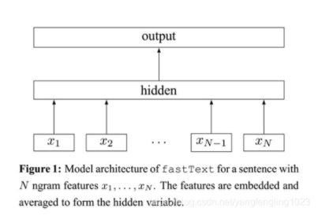

# Fasttext文本分类
## 参数设置
1. DEFAULT
    - uerdict_path 自定义词典的路径
    - stopwords_path 停用词词典的路径
    - tokenizer_name 分词器的名字
2. DATA_PROCESS
    - file_path 文件路径
    - save_path 保存初始化pickle文件路径
3. MODEL
    - lr 学习率
    - epoch 训练的轮数
    - wordNgrams 词语的ngram值
    - minCount 频数小于多少的词将被去掉 
    
每次训练必给的参数为:
* uerdict_path 自定义词典的路径
* stopwords_path 停用词词典的路径
* file_path 文件路径
* save_path 保存初始化pickle文件路径
## 模型架构

## 模型说明
使用facebook开源的fasttext文本分类模型，简单快速，适合大中小性文本，效果预期较好。

