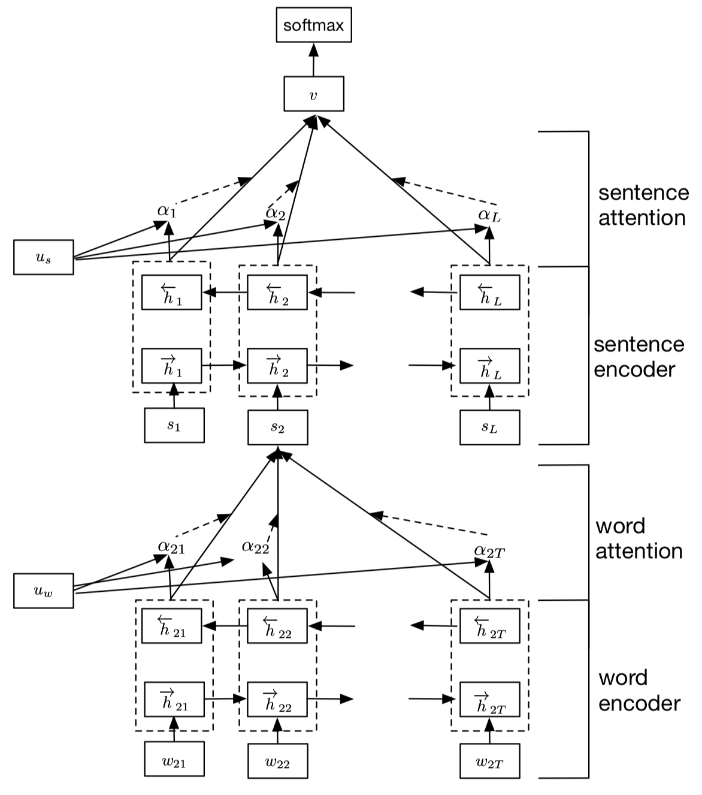

# Han文本分类
## 参数设置
1. DEFAULT
    - uerdict_path 自定义词典的路径
    - stopwords_path 停用词词典的路径
    - tokenizer_name 分词器的名字
2. DATA_PROCESS
    - file_path 文件路径
    - save_path 保存初始化pickle文件路径
    - word2vec_embed_file word2vec的路径
    - fasttext_embed_file fasttext的路径
    - feature_selection_name 选择预训练的模型名称
3. MODEL
    - max_seq_length 句子最大长度
    - num_sentences 分句的句子数量
    - is_training 是否开启训练
    - update_embedding 是否更新词向量
    - hidden_size 隐含层神经元个数
    - cell_nums lstm的层数
    - embedding_dim embedding的维度
    - learning_rate 学习率
    - use_decay_learning_rate 是否使用学习率衰减
    - use_l2_regularization 是否使用l2正则
    - num_train_epochs 训练轮数
    - batch_size 每批次样本数量
    - shuffle 每次训练是否随机打乱数据
    - dropout_rate dropout值
    - display_per_step 每多少步展示一次训练集效果
    - evaluation_per_step 每多少步展示一次验证集效果
    - require_improvement 有多少步没有提升，将停止训练  
    
每次训练必给的参数为:
* uerdict_path 自定义词典的路径
* stopwords_path 停用词词典的路径
* file_path 文件路径
* save_path 保存初始化pickle文件路径
* max_seq_length 句子最大长度
* num_sentences 分句的句子数量
## 模型架构

## 模型说明
HAN的全称为Hierarchical Attention Network(分级注意网络)，从字面意思就可以理解其是一个分层架构模型。该模型使用包含attention的lstm架构，训练速度不快，主要针对长文本。

