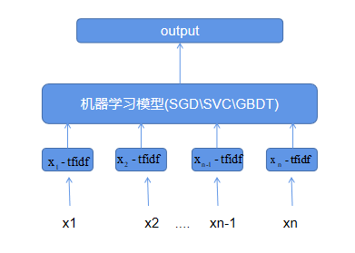

# 机器学习文本分类
## 参数设置
1. DEFAULT
    - uerdict_path 自定义词典的路径
    - stopwords_path 停用词词典的路径
    - tokenizer_name 分词器的名字
2. DATA_PROCESS
    - file_path 文件路径
    - save_path 保存初始化pickle文件路径
3. MODEL
    - max_df 筛选文本_最高词频熟
    - min_df 筛选文本_最低词频熟
    - ngram_range 词语的ngram值
    - classifier_name 机器学习模型选择(SGD、SVC、GBDT) 
    
每次训练必给的参数为:
* uerdict_path 自定义词典的路径
* stopwords_path 停用词词典的路径
* file_path 文件路径
* save_path 保存初始化pickle文件路径
## 模型架构

## 模型说明
使用sklearn集成的机器学习模型，底层特征为tfidf，主要以SGD为主，训练速度快，效果一般。

